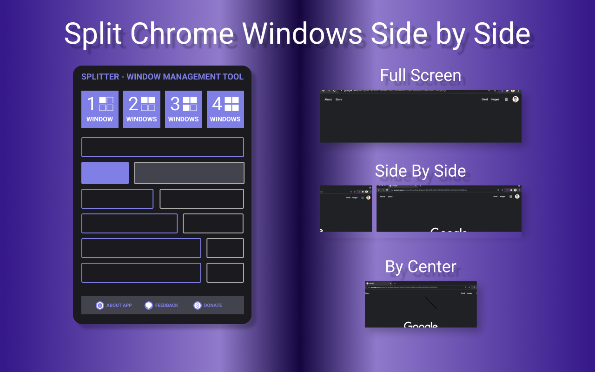

# Splitter

## Intro

Chrome extension to manage windows side by side on any position on the desktop

Available to donwload on Google Chrome Store [Splitter: the window layout tool](https://chrome.google.com/webstore/detail/splitter-the-window-layou/bipgnkelnldgmmhklakacokihndkcige)



## Development

Run dev server:

```sh
npm start
```

Release

1. Increament `manifest.json` version

1.

```sh
npm release
```

1. Go to develops console and upload `dist.zip`

## Self Promotion

Developers:

- itsnikolay (<https://nponomarev.com>)

Give the repo a ⭐ if you ❤️ it. Install and try
